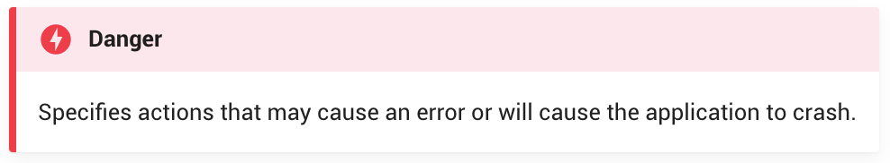
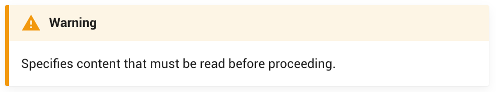
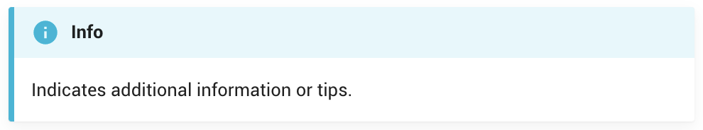

# Notion User Documentation Overview

## Welcome to Notion! 👋

### Introduction

This comprehensive guide is designed to navigate you through the setup and utilization of Notion for both personal and collaborative endeavors. As a multifaceted platform, Notion integrates note-taking, task management, databases, and more, offering a holistic solution for various organizational needs.

### Objective

Our documentation aims to equip you with the necessary insights and tools to proficiently harness Notion for streamlining your work and personal tasks. We delve into the essentials and advanced functionalities, emphasizing optimal practices for both individual and team productivity.

## Contents

- **Getting Started with Notion**

  - Setting up your Notion workspace
  - Navigating the Notion interface

- **Core Features**
  - Creating and customizing Notion pages
  - Building and managing Notion databases
  - Organizing with Notion calendars

## Collaborative Documentation Process

- **Communication and Division of Work**: Utilizing Discord as our primary communication channel, we divided the workload evenly, ensuring collective support and clarity throughout the documentation process.

- **Version Control with Git and GitHub**: We streamlined our collaborative efforts using Git and GitHub, facilitating seamless integration and updates to our documentation.

## Crafting the Notion Guide

- **Leveraging Experience and Research**: Drawing from our extensive use of Notion in areas like Software Development and Object-Oriented Programming, we enriched our guide with insights from Notion’s official resources and user communities.

- **Documentation with MkDocs**: We chose MkDocs for its simplicity and the aesthetically pleasing Material theme, enhancing our guide with various MkDocs plugins to improve functionality and design.

- **Markdown Mastery**: Our diverse experience with Markdown enabled us to craft a well-organized and formatted documentation, showcasing its effectiveness in structuring clear and concise content.

## Style and Structure

- **Consistency and Clarity**: Adopting a unified style guide, we ensured a coherent and accessible documentation flow, enhanced by strategic use of images and icons for visual support.

- **Pre-requisite Knowledge**: We included a section detailing the foundational knowledge required for users to effectively follow our guide.

## Principles of Effective Documentation

### Clarity and Precision

- **Clear Objective**: Each section begins with a clear statement of objectives, guiding readers through the documentation with purpose and direction.
- **Precise Language**: We use concise and specific language to eliminate ambiguity, ensuring that the information is straightforward and easily understood.

### Engaging and Accessible Content

- **Interactive Elements**: Incorporate interactive tutorials and clickable content within the documentation to engage readers actively and enhance the learning experience.
- **Accessibility**: Ensure that the documentation is accessible to a diverse audience, including those with disabilities, by adhering to web accessibility standards.

### Structured and Logical Flow

- **Logical Structure**: Organize content in a logical sequence that builds upon each section, facilitating a natural progression through topics and concepts.
- **Consistent Format**: Maintain a consistent format throughout the documentation, using headers, lists, and tables to organize information effectively.

### Visual Aids and Examples

- **Illustrative Images and Icons**: Use relevant images and icons to complement the text, making complex concepts easier to understand.
- **Practical Examples**: Provide real-world examples and case studies to illustrate how Notion can be applied in various scenarios, enhancing practical understanding.
- **Admonitions**: We used MkDocs' admonitions to highlight any information we wanted to stand out to the reader.

<figure>
  <figcaption>Specifies actions that may cause an error or will cause the application to crash.</figcaption>
  
</figure>
<figure>
  <figcaption>Specifies content that must be read before proceeding.</figcaption>
  
</figure>
<figure>
  <figcaption>Indicates additional information or tips.</figcaption>
  
</figure>
<figure>
  <figcaption>Indicates what success looks like.</figcaption>
  
</figure>

### Interactive and Supportive Tone

- **Conversational Tone**: Adopt a friendly and supportive tone, encouraging readers to explore Notion’s features without feeling overwhelmed.
- **Empowering Language**: Use empowering language that motivates readers to experiment and leverage Notion to its full potential.

## Conclusion

Our Notion User Documentation encapsulates our extensive engagement with Notion, presenting a detailed exploration of its capabilities. This endeavor not only deepened our understanding of Notion but also refined our skills in producing accessible and effective online documentation.

We trust that this documentation will serve as a comprehensive and engaging resource, aiding you in optimizing your workflow with Notion. Thank you for considering our Notion User Documentation, and we are enthusiastic about aiding your journey in mastering Notion for project management and organization.
