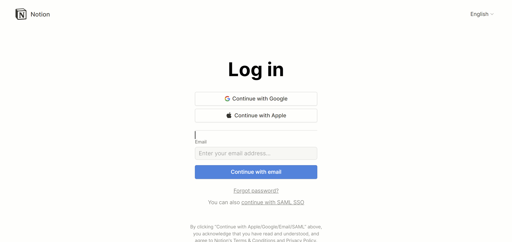
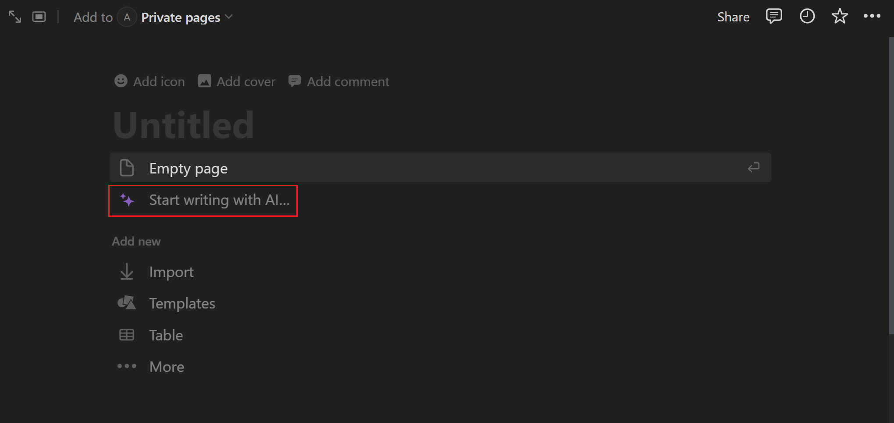
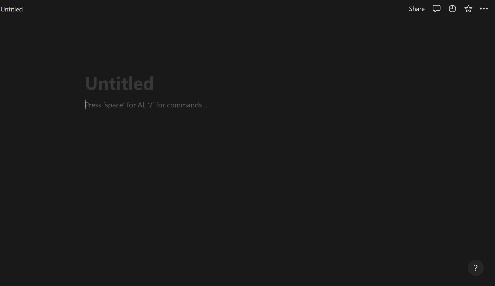

# Creating a Notion Page

## Overview

Crafting a Notion page provides a straightforward yet powerful method for jotting down notes, organizing tasks, and more. With its intuitive interface and versatile features, Notion offers an accessible platform for managing information and productivity effortlessly.

This guide aims to provide a clear understanding of how to create a Notion page, its functionality, and additional features to enhance your Notion experience.

## Pre-requisites:
  - **Notion account:** sign up for a Notion account [here](https://www.notion.so/signup).

## Setting up a Notion Page

1. **Log in to Notion:** [Click here to log in](https://www.notion.so/login) then access your Notion homepage.
    

2. **Create a New Page:** Left click on the *New Page* button located in the sidebar on the left side of your Notion homepage.
    

3. **Name Your Notion Page:** Left click on the *Untitled* box and name your Notion page.

    !!! info "Info"
        We recommend naming your Notion page to ensure better organization.
    

## Customizing Your Notion Page
Now that you know the basic outline of creating a page, you need to customize it based on your preferences. Below are five customization features directly related to creating a page:

1. **Write with AI:** Left click on the *Start Writing with AI* button located under the name of your Notion page.
    

    !!! info "AI Tool"
        The AI tool provides an ideal starting point for creating your Notion page, if you are unsure on what to write or desire a particular layout.

2. **Import Data:** Left click on the *Import* button located under *Add New* and then select the app you would like to import from.
    

    !!! info "Import Data Options:"
         
         When creating a page, you can import data from other apps like Trello, CSV, Google Docs, and Word. Importing files is important for storing your data on a reliable page.

3. **Choose a Template:** Left-click on the *Templates* button located beneath *Import* and pick the template that suits your needs.
    
    

    !!! info "Templates"
        You can explore the pre-designed pages available in Notion if you are uncertain about the appearance you want for your page or if you desire a specific layout.

4. **Generate an Empty Page:** Left click on the *Empty Page* button located under your page title to create an empty page with no predefined content.
    

    !!! success "Empty Notion Page View"
        

5. **Incorporate Icons:** Left click on the *Add Icons* button located at the top left corner of the page and choose your desired icon(s).
    
    

    !!! info "Icons"
          Another aspect of page customization is the addition of icons. Icons serve to characterize a page and elevate a page's visual appeal.

6. **Add Cover or Comment:** Left click on *Add Cover* or *Add Comment* right above the name of the page to include a cover at the top or leave a comment right below the page name.
   

7. **Saving Changes:** Press &lt;Enter&gt; on your keyboard and exit the new page screen when you are finished customizing your Notion page.

While this serves as a fundamental guide to page creation, there are numerous possibilities to tailor your page to suit your needs best.

## Conclusion

By the end of this section, you should have learned the following topics:

✅ Logging into Notion  
✅ Creating a Notion page  
✅ Learning the customization features of creating a Notion page  

Congratulations! You have learned how to create a Notion Page 🥳. You can click on the links below to learn how to create a Notion Calendar or Notion Database: 

[Creating a Notion Calendar](./Annabelle-createACalendar.md)  
[Creating A Notion Database](./Evann-createADatabase.md)