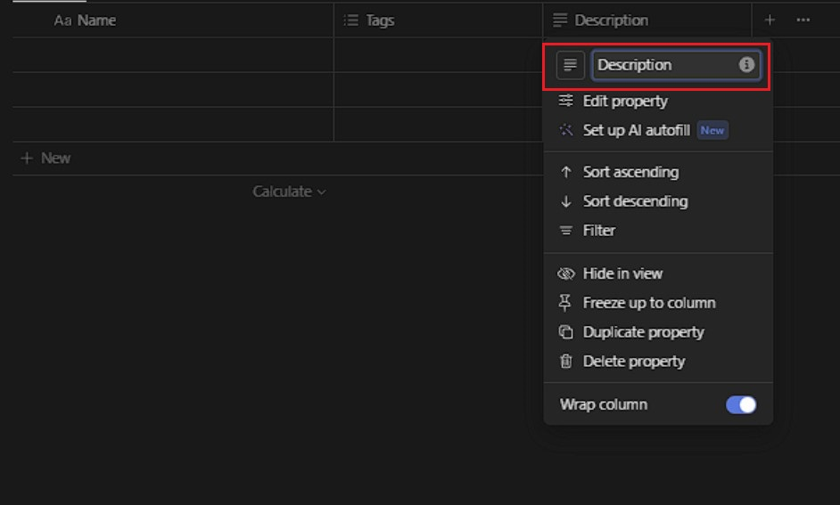

# Creating a Database in Notion

## Overview

This section aims to guide you through the process of setting up a database within a Notion page. Databases offer valuable assistance in organization, providing flexibility, and facilitating filtering and sorting functionalities to efficiently manage your information.

## Pre-requisites:
- **Notion account:** sign up for a Notion account [here](https://www.notion.so/signup) .

## Creating a New Page

1. Open and sign in to [Notion](https://notion.so/)

2. Left click on the *+ New Page* in the top-left corner to create a new page.

    

3. Left click on the bottom half of the new page window that comes up. Enter the command ``` /database ``` to bring up a list of possible database templates that Notion has and choose the one best suited for your needs.

    

## Creating the Database

1. Give your database a name by clicking on *Untitled* box at the top of the page and typing in the desired name.

    

    !!! success "Success"
        

## Customizing the Database

1. Left click on the *+* button on the top row to display a list of various types of properties you can add. Choose the one that aligns best with your requirements.

    

    

    !!! info "Info"
        You can customize your database by adding additional properties to fit your needs

2. Left click on a column name in the top row to open an editing menu for the column. You can modify the name using the top option. Press &lt;Enter&gt; on your keyboard to confirm your changes.

    

3. Left click on the *+ New* button located below the last entry or directly on the empty cells in the database table to begin populating your database. Then, input the relevant information for each entry according to the defined properties.

    

4. Left click on the column name to access filters, allowing you to organize your database by grouping entries, sorting them, or filtering them based on specific criteria, such as sorting in ascending/descending order or filtering by keyword.

    

## Using Views

1. Left click on the *+* button located right below the title to open the views menu. Select the desired view, and Notion will generate it for you.

    

    

!!! info "Info" 
    Feel free to explore various views of your database, including board view, list view, or gallery view, to discover the most suitable option for your requirements.

## Sharing Your Database

1. Left click on the *Share* button located at the top right corner, then modify the sharing settings. Invite collaborators via email or generate a shareable link to collaborate with others or share your database.
    

## Further Customizing and Iterating

While working with your database, feel encouraged to customize it further or incorporate additional properties to align better with your workflow and information management requirements.

## Conclusion

By the end of this section, you will have successfully learned the following:

✅ Create a Notion Database  
✅ Create a Notion Database View  
✅ Customize a Notion Database

Congratulations you have learned how to create a Notion Databse 🥳. You can click on the links below to learn how to create a Notion Page or Notion Calendar:

[Creating a Notion Page](Ahmed-createAPage.md)  
[Creating a Notion Calendar](Annabelle-createACalendar.md)