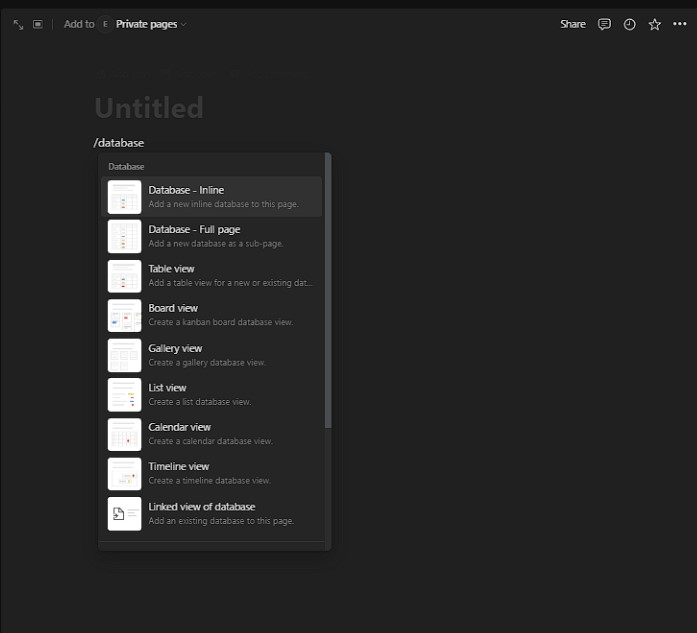

# Creating a Database in Notion

## Overview

This section will focus on helping you set up a database inside of a Notion page. Databases are helpful for organization, flexibility, as well as filterting and sorting.

## Pre-requisites:
- **Notion account:** sign up for a Notion account [here](https://www.notion.so/signup) .

## Creating a New Page

1. Once logged in, click on "+ New Page" in the top-left corner to create a new page.

2. Click on the bottom half of the new page window that comes up. Enter the command "/database" to bring up a list of possible database templates that Notion has and choose the one best suited for your needs.

## Creating the Database

Give your database a name by clicking on "Untitled" at the top of the page and typing in the desired name.

## Customizing the Database

1. You can customize your database by adding additional properties to fit your needs. Click on the "+" button on the top row to bring up a list of the different types of properties you can add. Choose the one that best fits your needs.

2. Click on a column name on the top row to bring up an editing menu for the column. You can change the name through the top option. Press enter to confirm your change.

3. Start populating your database by clicking on the "+ New" button below the last entry or by directly clicking on the empty cells in the database table. Enter the relevant information for each entry based on the defined properties.

4. Organize your database by grouping entries, sorting them, or filtering them based on specific criteria. Click on the column name to bring up filters such as sort ascending/descending or by keyword.

## Using Views

You can experiment with different views of your database, such as a board view, list view, or gallery view, to find the one that works best for your needs. Click on the "+" right under the title to pull up the views menu. Click on the view you want and Notion will create it for you.

## Sharing Your Database

If you want to collaborate with others or share your database, click “Share” at the top right and adjust the sharing settings and invite collaborators via email or by generating a shareable link.

## Further Customizing and Iterating

As you work with your database, feel free to further customize it or add more properties to better suit your workflow and information management needs.

## Conclusion

By the end of this section, you will have successfully learned the following:

✅ Create a Notion Database  
✅ Create a Notion Database View  
✅ Customize a Notion Database

Congratulations you have learned how to create a Notion Databse 🥳. You can click on the links below to learn how to create a Notion Page or Notion Calendar:

[Creating a Notion Page](Ahmed-createAPage.md)  
[Creating a Notion Calendar](Annabelle-createACalendar.md)